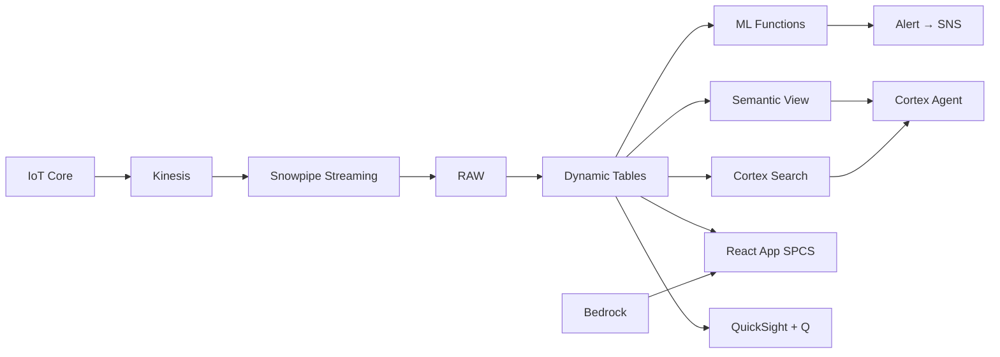

# Refinery Operations Intelligence

Real-time monitoring of Malaysia's refinery operations — IoT sensors stream process data, ML.ANOMALY_DETECTION catches excursions, and React Canvas visualizes the refinery digital twin.

## Architecture

Malaysia's Pengerang Integrated Complex is one of Asia's largest refining hubs, processing 300,000 bbl/d. An alarm spike across 24 process units signals a potential catalyst deactivation event in the reformer — but with 2M sensor readings per day, finding the root cause requires AI that understands process engineering context.



## Snowflake Capabilities

| Capability | Implementation |
|-----------|---------------|
| Dynamic Tables | UNIT_AVAILABILITY / SENSOR_TIMESERIES / ALARM_SUMMARY / THROUGHPUT_ECONOMICS |
| ML Functions | ML.ANOMALY_DETECTION + ML.FORECAST |
| Cortex AI | SUMMARIZE, AI_CLASSIFY |
| Cortex Search | 80 documents indexed |
| Cortex Agent | REFINERY_OPERATIONS_AGENT |
| Semantic View | REFINERY_ANALYTICS |
| React App (SPCS) | 5 tabs + DemoGuide |


## AWS Services

| Service | Role in Demo |
|---------|-------------|
| AWS IoT Core | Ingest 2M sensor readings/day from DCS and SCADA systems |
| Amazon Kinesis | Stream sensor data with sub-second latency to Snowpipe Streaming |
| AWS IoT TwinMaker | Refinery digital twin visualization with 3D process unit models |
| Amazon SNS | Push notifications for critical alarm events to operations teams |
| Amazon Bedrock (Claude) | Generate alarm root-cause narratives and shift handover summaries |
| Amazon QuickSight + Q | Operations dashboard with natural language query for plant manager |


## Personas

| Persona | Role | Key Questions |
|---------|------|---------------|
| **Encik Razali bin Hassan** | Plant Manager | "What's our overall unit availability this week?" "Which process units triggered alarms in the last 48 hours?" |
| **Eng. Liew Kok Wai** | Process Engineer | "What caused the CDU temperature spike at 02:00?" "Show me the anomaly timeline for Unit 7 reformer" |


## Data

| Table | Rows | Description |
|-------|------|-------------|
| PROCESS_UNITS | 24 | Refinery process units (CDU, VDU, FCC, reformer, hydrotreater, etc.) |
| SENSOR_READINGS | 2,000,000 | IoT sensor data — temperature, pressure, flow, level, vibration |
| ALARM_HISTORY | 5,000 | Process alarm events with severity and acknowledgement status |
| MAINTENANCE_LOG | 3,000 | Work orders, PM schedules, corrective maintenance records |
| OPERATIONS_DOCS | 80 | Operating procedures, safety bulletins, turnaround reports |
| REFINERY_ECONOMICS | 365 | Daily crack spread, throughput value, and margin data |


## Build Instructions

### Prerequisites
- Snowflake account with ACCOUNTADMIN access
- Cortex AI enabled (ML Functions, Search, Agent)
- Warehouse: OG_REFINERY_WH (Medium)
- AWS CLI with access (us-west-2)

### Deployment

```bash
snowsql -f snowflake/00_setup.sql
snowsql -f snowflake/01_marketplace_install.sql
snowsql -f snowflake/02_raw_tables.sql
snowsql -f snowflake/03_staging.sql
snowsql -f snowflake/04_dynamic_tables.sql
snowsql -f snowflake/05_search.sql
snowsql -f snowflake/06_ml_models.sql
snowsql -f snowflake/07_semantic_view.sql
snowsql -f snowflake/08_agent.sql
```

### React App (SPCS)
```bash
cd app && npm ci && npm run build
docker build -t aws-malaysia-oil-gas-refinery-app .
docker push bdiqc8sm-default.registry.snowflakecomputing.com/oil_gas_refinery/app/aws_malaysia_oil_gas_refinery/app:latest
```

### Demo Mode
Open the app URL with `?demo=true` for presenter view.

## Build Modes

### Snowflake Only
Run scripts 00-08 (skip AWS-specific integration). Uses:
- **Snowpipe Streaming SDK** instead of AWS IoT Core
- **Snowpipe Streaming SDK (direct)** instead of Amazon Kinesis
- **React Canvas (SPCS) with unit diagrams** instead of AWS IoT TwinMaker
- **Alerts + Notification Integration** instead of Amazon SNS
- **Cortex Complete** instead of Amazon Bedrock (Claude)
- **Snowflake Intelligence (Cortex Analyst)** instead of Amazon QuickSight + Q

### Full AWS + Snowflake
Run all scripts including AWS integration. Deploy QuickSight dashboard from `quicksight/`.

## Business Impact

Industry research and Snowflake customer outcomes:
- **Malaysia's refining capacity reached 796,500 bbl/d with Pengerang as the flagship complex** — [EIA](https://www.eia.gov/international/analysis/country/MYS)
- **Unplanned refinery shutdowns cost $1-5M per day in lost production and restart costs** — [Solomon Associates](https://www.solomoninsight.com/)
- **AI-enabled process monitoring reduces unplanned downtime by 30-50% in refining** — [McKinsey Chemicals](https://www.mckinsey.com/industries/chemicals/our-insights)
- **Real-time data platforms enable predictive maintenance saving 8-12% on maintenance costs** — [Deloitte Industry 4.0](https://www2.deloitte.com/us/en/insights/focus/industry-4-0.html)


## Key Demo Numbers

- **24 process units** monitored in real-time across the refinery complex
- **2M sensor readings/day** ingested via Snowpipe Streaming from DCS/SCADA
- **42 alarms** in the last 48 hours (6 HIGH severity)
- **98.2% unit availability** overall — Unit 7 dropped to 91%
- **RM 1.8B** monthly throughput value at risk
- **3 excursions** detected by ML.ANOMALY_DETECTION in 48 hours
- **80 operations docs** indexed and searchable via Cortex Search


## License

Apache 2.0 — See [LICENSE](LICENSE) for details.

This is a personal demo project and is not an official Snowflake offering. It comes with no support or warranty.